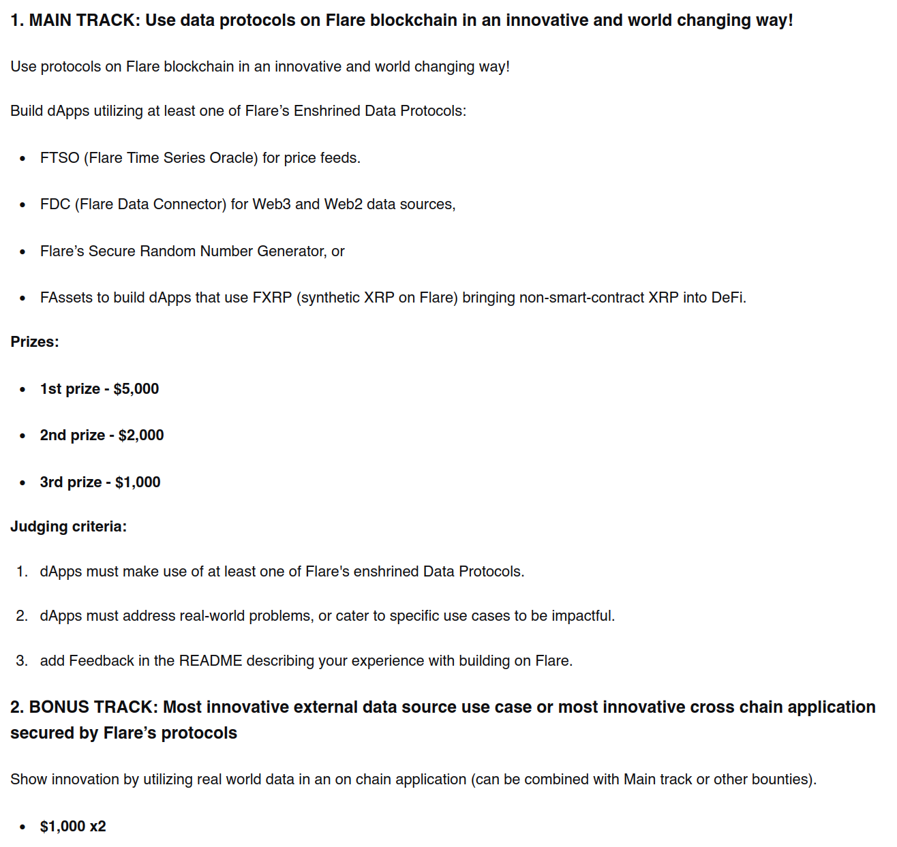

# Le grand bain d'ETH-Oxford

Participer à mon premier hackathon était une aventure aussi excitante qu'intimidante. Durant le voyage pour me rendre à Oxford, les questions se bousculaient dans ma tête. Nous formions une équipe de trois avec mes acolytes Hugo et Stan. Notre objectif était clair : construire une solution utile, techniquement viable et répondant à un vrai besoin de sécurité dans l'écosystème Web3.

## Les premières 24 heures

Dès notre arrivée, nous nous sommes lancés dans le CTF (Capture The Flag) organisé par SUI, avec l'espoir de décrocher un prix réservé aux 20 premiers. Bien que nous ayons été un peu trop lents pour le podium, nous avons relevé le défi haut la main en réussissant l'intégralité des challenges du CTF. 

Après cet échauffement intense, nous avons décidé de prendre une nuit de repos à l'hôtel pour réfléchir posément à une idée solide répondant au thème imposé par Flare.

Voici la track de Flare et le [lien](https://flare-network.notion.site/Flare-Hackathon-Guide-ETH-Oxford-2026-2e6d502e6fa680598c39c7103e3c4763)

## Les dernières 48 heures

Une fois le concept validé et les recherches de faisabilité technique terminées, nous sommes retournés sur le site d'Oxford pour entamer la phase de développement pur. Un véritable sprint de 48 heures venait de commencer.

# Le problème et la solution (EdelPay)

Aujourd'hui, les paiements en crypto-monnaies manquent souvent d'un pont fiable avec les systèmes de confiance du monde réel. Notre idée était de lier la sécurité et la rapidité de la blockchain XRPL à la robustesse d'un système d'identité étatique.

**EdelPay** est né de cette vision : une solution de paiement Web3 nativement sécurisée par l'identité numérique suisse.

Notre proposition de valeur repose sur deux piliers majeurs :
- **La confiance :** Vérifier l'identité de l'utilisateur de manière décentralisée.
- **La sécurité des fonds :** Prévenir les hacks et les erreurs de manipulation, souvent fatals pour le grand public sur le Web3.

# Architecture et défis techniques

Pour donner vie à EdelPay en un week-end, nous avons déployé une architecture transverse :

- **Smart Contract (Solidity) & Flare Data Connector :** C'est le cœur de notre backend. Le smart contract sert de point d'entrée au système de validation des identités numériques suisses que nous avons mis en place. Le *Flare Data Connector* fournit la preuve cryptographique via un consensus de plusieurs serveurs, permettant de valider l'identité numérique directement on-chain.
- **Le système de Vault anti-fraude :** La technologie de Flare nous a permis d'architecturer un coffre-fort intelligent. Il agit comme un sas de sécurité pour détecter et bloquer les comportements anormaux basés sur l'adresse du wallet, offrant une couche de protection indispensable pour une adoption grand public.
- **L'interface utilisateur (React & TypeScript) :** Nous avons développé un frontend soigné pour rendre l'expérience utilisateur la plus fluide possible, avec une intégration transparente des wallets tiers (MetaMask, Xaman, etc.). Nous avons ainsi implémenté deux parcours distincts : celui de l'acheteur et celui du vendeur.

## Parcours utilisateur


flowchart TD
    Start([Accueil : localhost:3000]) --> Connect{Connexion Wallet Header}
    Connect -->|XUMM, GEM ou Crossmark| Middleware{Middleware Vérification statut KYC}
    Middleware -->|Non enregistré| KYC_Page[/"Redirection vers /kyc/"/]
    KYC_Page --> EdelID[Vérification d'identité via Edel-ID]
    EdelID --> Success([Succès KYC])
    Middleware -->|Déjà enregistré| RoleCheck{Sélection du Rôle}
    Success --> RoleCheck
    RoleCheck -->|Acheteur| BuyerDash[/"Redirection vers /buyer-dashboard/"/]
    RoleCheck -->|Vendeur| SellerDash[/"Accès à /seller-dashboard/"/]
    BuyerDash --> B_Action(Parcourir les annonces et acheter)
    SellerDash --> S_Action1(Gérer les annonces)
    SellerDash --> S_Action2(Enregistrer les mappings Vendeur-Payeur)


## Flux de transaction


sequenceDiagram
    autonumber
    actor Vendeur
    actor Acheteur
    participant EdelPay as EdelPay (Smart Contract)
    participant XRPL as Réseau XRPL
    participant Flare as Flare State Connector

    Note over Vendeur, EdelPay: Initialisation par le Vendeur
    Vendeur->>EdelPay: Dépose le collatéral pour le produit
    Vendeur->>EdelPay: Enregistre le mapping (Vendeur - Adresse Payeur)
    
    Note over Acheteur, EdelPay: Achat et Garantie
    Acheteur->>EdelPay: Sélectionne le produit (option paiements échelonnés)
    EdelPay->>EdelPay: Séquestre le collatéral du vendeur comme garantie

    Note over Acheteur, Flare: Phase de Paiements Mensuels
    loop Pour chaque mensualité
        Acheteur->>XRPL: Envoie le paiement mensuel
        Flare->>XRPL: Observe et capture l'état de la transaction
        Flare->>EdelPay: Fournit la preuve du paiement on-chain
        EdelPay->>EdelPay: Met à jour le solde du payeur
        Vendeur-->>EdelPay: Suit la progression des paiements en temps réel
    end

    Note over Acheteur, EdelPay: Finalisation
    EdelPay->>EdelPay: Détecte le paiement final complété
    Acheteur->>EdelPay: Réclame la récupération du collatéral/bien
    EdelPay->>Acheteur: Transfère la garantie à l'acheteur


# Ce que j'ai appris

Ce premier hackathon a été une introduction accélérée au monde de la blockchain et du développement sous haute pression. J'ai pu acquérir et renforcer plusieurs compétences clés :

- **Gestion du temps et "Scope" :** En temps limité, chercher la perfection absolue ou faire de l'*overengineering* est le pire ennemi du livrable. J'ai appris à prioriser les fonctionnalités critiques au détriment de détails secondaires, et surtout à oser poser des questions aux ingénieurs de Flare présents pour nous encadrer.
- **Intégration technologique sous pression :** J'ai dû assimiler très rapidement le fonctionnement du *Flare Data Connector* et comprendre concrètement comment une blockchain interagit de manière sécurisée avec le monde extérieur.
- **La force du travail d'équipe :** Travailler avec Stan, qui avait déjà une solide expérience en blockchain, a été une chance incroyable. Il a su endosser le rôle de mentor pour nous guider sur les concepts architecturaux les plus complexes.

# Un podium pour une première !

Décrocher ce **2ème prix** à ETH-Oxford pour mon tout premier hackathon a été un déclic. Cela m'a permis de briser de nombreuses croyances limitantes et de mesurer tout le potentiel des compétences acquises depuis le début de ma formation de Bachelor à la **HEIG-VD**.

EdelPay restera le projet qui m'a prouvé que j'étais capable de concevoir, développer et pitcher un produit Web3 complexe en un seul week-end au sein d'une équipe soudée.